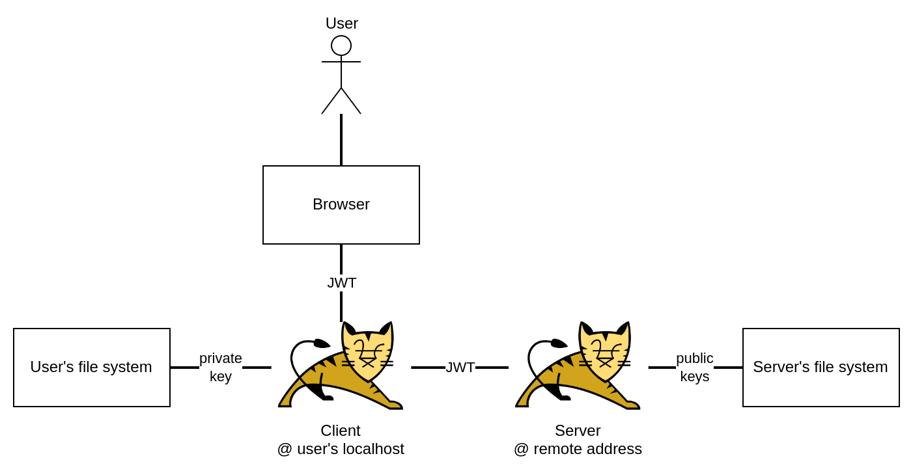

# Information Security Project 2021/2022

An email server and client implemented with Tomcat to test hacking techniques and understand related defence methods. 

Made at the [Free University of Bolzano](https://unibz.it)

## Features

- JWT for authentication and authorization
- End-to-end encryption of emails using RSA (SHA-256, with 4096 bits long keys)
- Optional digital signature using DSA (SHA-256, with 4096 bits long keys)
- Password hashing and salting (56 characters long salt encoded in base64)
- SQL injection prevention
- Reflected XSS and stored XSS prevention
- Configuration files for both client and server settings

## Architecture

The source code of this project is not meant to be deployed as it is.
Client and server code run on the same Tomcat instance, which would never be the case in a real-world scenario.

For an actual deployment, the client and the server code would be split on two separate Tomcat instances, making the architecture look like the following.



While the browser is referred to as the client usually, notice that in this case the Tomcat instance running on the user's machine is called the client.
The browser is only used for the GUI, which is unfamiliar to modern conventions and might be confusing when first looking at the project.

These rules are followed throughout the codebase to keep the client and the server apart:
- The package `client` does not use the package `server` and vice versa.

### But why?

The complexity and unconventionality of this architecture can justly create some doubts on its appropriateness. The reason for this architecture was to be able to run Java on the client, use it to generate RSA keys, send to the server only the public key. Since Java cannot run in the browser, the only way to achieve this, without switching to JavaScript, is to use a local web server as "the client".

Technically, another possibility would have been to write the client as a Java application that uses JavaFX for the GUI.
Tomcat would then be used for the server only.

## Setup

Install Java 11 or later.

Download [Tomcat 10.0.x](https://tomcat.apache.org/download-10.cgi) as zip file and remember where you place the 
extracted directory.

Install IntelliJ IDEA and open the project with IntelliJ IDEA. The community edition suffices.

Install the plugin [Smart Tomcat](https://plugins.jetbrains.com/plugin/9492-smart-tomcat).

Open IntelliJ IDEA's settings and go to `Tomcat Server`. Click on the top-left plus sign to add specify where your 
local Tomcat files are.

### Set up the SQL server

Run the container executing the following command from the project's root directory:
```sh
docker compose up -d
```

To connect to the SQL Server in the container and have an interactive shell:

```sh
docker exec -ti mssql bash -c '/opt/mssql-tools/bin/sqlcmd -S localhost -U sa -P "$SA_PASSWORD" -d dev'
```

_Note: This uses the environment variable `SA_PASSWORD` of the container, not the one of your shell._

Enter the SQL statements specified in the file `create.sql`.

Quit the interactive shell.

## Run the web server

In the top right corner, click on the 'Run Tomcat 1' button to start the web server.
A terminal should open showing Tomcat's logs and the URL to visit.

## Useful SQL queries

### Listing all tables

```sql
SELECT TABLE_NAME FROM INFORMATION_SCHEMA.TABLES;
```

## Author

- Gioele De Vitti (17693)